# Integration and Messaging 

> This is not an exhaustive documentation of all the existing AWS Services. This is just my quick summarized notes for studying for the AWS Certifications. To see the complete AWS Documentations, please go to: https://docs.aws.amazon.com/

- [Integration and Messaging](#integration-and-messaging)
- [SQS - Simple Queue Service](#sqs---simple-queue-service)
    - [SQS - Standard Queue](#sqs---standard-queue)
    - [SQS - Delay Queue](#sqs---delay-queue)
    - [SQS - FIFO Queue](#sqs---fifo-queue)
    - [Producing Messages](#producing-messages)
    - [Consuming messages](#consuming-messages)
    - [Message Visibility Timeout](#message-visibility-timeout)
    - [Dead Letter Queues](#dead-letter-queues)
    - [Long Polling](#long-polling)
    - [Message Consumption Flow](#message-consumption-flow)
    - [SQS With Auto Scaling Group](#sqs-with-auto-scaling-group)
    - [SQS Extended Client](#sqs-extended-client)
    - [Decouple application tiers](#decouple-application-tiers)
    - [Data Ordering in SQS](#data-ordering-in-sqs)
    - [Security](#security)
- [SNS - Simple Notification Service](#sns---simple-notification-service)
    - [AWS SNS](#aws-sns)
    - [Integrations](#integrations)
    - [Publishing events](#publishing-events)
    - [SNS + SQS Fan Out](#sns--sqs-fan-out)
- [AWS Kinesis](#aws-kinesis)
    - [Kinesis Streams](#kinesis-streams)
    - [Kinesis Data Firehose](#kinesis-data-firehose)
    - [Kinesis Data Analytics](#kinesis-data-analytics)
    - [AWS Kinesis API](#aws-kinesis-api)
        - [Put Records](#put-records)
        - [Exceptions](#exceptions)
        - [Consumers](#consumers)
    - [AWS Kinesis CLI](#aws-kinesis-cli)
    - [Security](#security)
    - [Ordering data into Kinesis](#ordering-data-into-kinesis)
    - [Ordering data into SQS](#ordering-data-into-sqs)
- [Summary - SQS vs SNS vs Kinesis](#summary---sqs-vs-sns-vs-kinesis)
- [Amazon MQ](#amazon-mq)


## Integration and Messaging

When we start deploying multiple applications, they will inevitable result in the necessity to communicate with one another 

||
|-|

- There are 2 types of integration communication patterns:

    - Synchronous communication
    - Asynchronous communication

- Synchronous communication between applications can eb problematic if there are sudden spikes of traffic 
- As a solution, decouple your applications 
- Application decoupling models:
    - SQS: queue model
    - SNS: pub/sub model
    - Kinesis: real-time streaming model

## SQS - Simple Queue Service

|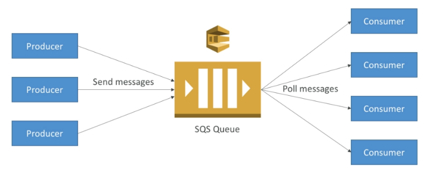|
|-|

### SQS - Standard Queue

- Oldest offering on AWS (over 10 years old)
- Fully managed service, used to decouple applications
- Can have duplicate messages (at least once delivery)
- Can have out of order messages (best effort ordering)
- Attributes:
    - Unlimited throughput
    - Unlimited number of messages in the queue
    - Each message is short leaved: 
        - default retention period is 4 days
        - maximum is 14 days
    - Low latency: 
        - <10 ms on publish and receive
    - Limitation for message size: 
        - maximum size of a message is 256KB

### SQS - Delay Queue

- Delaying a message means the consumers wont be able to see the message for a period of time after it was sent. Delay time can be up to 15 minutes
- Delay can be set at a queue level or tt also can be set to message level using the **DelaySeconds** parameter

### SQS - FIFO Queue

- FIFO - First In First Out
- The messages will be ordered in the queue, meaning that the messages will be consumed in the same order as they were sent
- FIFO queues have limited throughput: 300 msg/s without batching, 3000 msg/s with batching
- Exactly-once send capability (by activating content-based deduplication)
- The name of the FIFO queue must end with the `.fifo`

|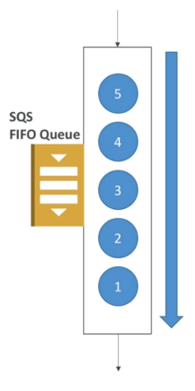|
|-|

### Producing Messages

- Producers send messages to the queue using the SDK (SendMessage API)
- The message is persisted on the queue until a consumer deletes it
- Message retention: default 4 days, up to 14 days
- SQS standard has unlimited throughput

|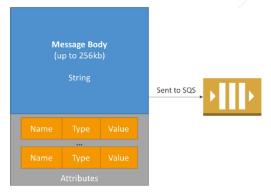|
|-|

### Consuming messages

- Consumers are applications (running on EC2 instances, other servers or AWS Lambda)
- Consumers poll the queue for messages (they can receive up to 10 messages at a time)
- After the messages are processed the consumers delete the messages from the queue using DeleteMessage API
- Multiple consumers:
    - Consumers receive the messages in parallel
    - Each consumer consumes a fraction of the number of the messages sent
    - We can scale the number of the consumers based on the throughput of processing
- SQS with Auto Scaling Group:
    - We can scale based on the **ApproximateNumberOfMessages** metric by creating a CloudWatch alarm

||
|-|


### Message Visibility Timeout

- After a message is polled by a consumer, it becomes invisible to other consumers
- Default message visibility timeout is 30 seconds, which means the consumer has 30 seconds to process the message
- After the message visibility timeout is over, the message becomes visible to other consumers
- If the processing is not finished during the visibility timeout, there is a chance the message will be processed twice
- If a consumer knows that the processing wont finish in time, it can use the **ChangeVisibility** API to request more time
- If the message visibility timeout is high and the processing fails, it may take a long time for the message to be processed again
- If the visibility timeout it too short, we may end up processing the same message twice
- Best practice: the visibility timeout should be set to something appropriate. The consumer must be implemented in a way to use the ChangeVisibility API

### Dead Letter Queues

- If a consumer fails to process a message within the visibility timeout, the messages goes back to the queue. This can happen multiple times.
- We can set a **MaximumReceives** threshold, which denotes how many time a message should be able to go back to the queue
- If the MaximumReceives threshold is exceeded, the message is sent to a dead letter queue
- DLQs are useful for debugging
- We have to make sure the messages are processed in DLQ before expiring. It is not a good idea to set a short expiration time for the DLQ

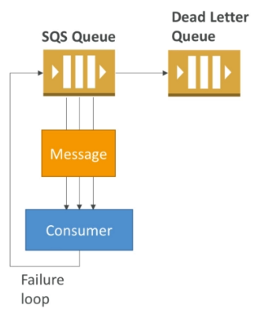


### Long Polling 

- When a consumer requests messages from the queue, it can optionally wait for messages to arrive if there are none in the queue 
- Long polling decreases the number of API calls made to SQS while increasing efficiency
- Wait time can be between 1 sec to 20 sec 
- Long polling is preferable than short polling 

|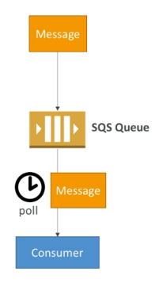|
|-|

### Message Consumption Flow

|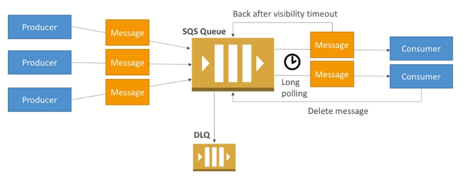|
|-|


### SQS With Auto Scaling Group

|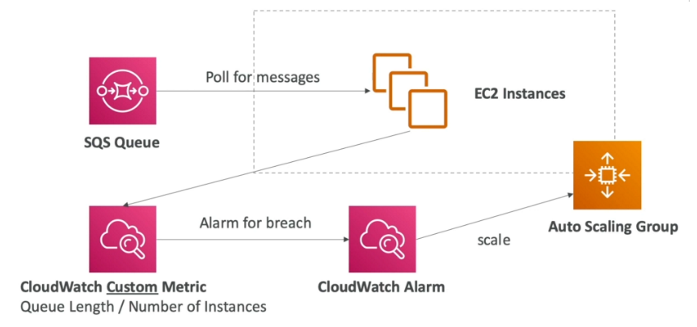|
|-|

Allows scaling the number of EC2 instances based on the available messages in the queue
- In order to accomplish auto scaling we have to create a CloudWatch custom metric representing the number of available messages on the queue divided by the number of EC2 instances. - This metric is pushed from an EC2 instance

If the variable goes above the threshold value, this may mean:
	
- there are many  messages, or
- there are nt enough instances to process those messages.

When we set the threshold value, we can set maybe set TWO ALARMS

- when variable is below threshold value
- when variable is above threshold value 

When the variable goes above the threshold value, then alarms are breached and it will do the following:

- Cloudwatch alarm can be assigned with a scaling policy on your ASG. 
- It can scale your ASG accordingly.

### SQS Extended Client 

- Message size limit is 256KB, how to send large messages?
- For this, use SQS Extended CLient (Java library)

||
|-|


### Decouple application tiers 

|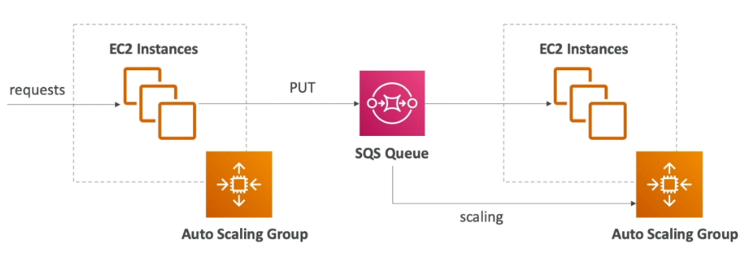|
|-|

### Data Ordering in SQS

- For standard SQS queues there is no data ordering
- For SQS FIFO, if we don't use a Group ID, messages are consumed in the order they are sent, with **only one consumer**
- Messages can be group by specifying a Group ID for the message
- For each group we can have different consumers, which will read messages in order


### Security

**Encryption**

- In-flight encryption using HTTPS
- At-rest encryption using KMS
- Client-side encryption if the client wants to perform encryption/decryption itself

**Access Control**

- IAM policies to regulate access to the SQS API

**SQS Access Policies**

- Useful for cross-account access to SQS queues
- Useful for allowing other services (SNS, S3) to write to an SQS queue


## SNS - Simple Notification Service

|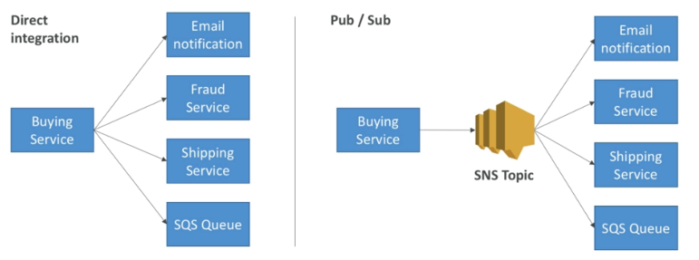|
|-|

### AWS SNS 

- Pub/Sub model
- The event produces only sends messages to one SNS topic
- Each subscriber to the topic will get all the messages be default (we can filter them, if we want)
- We can have up to 10 million subscribers per topic
- We cave up to 100K topics
- Subscribers to the topic can be:
    - SQS
    - HTTP/HTTPS
    - Lambda
    - Emails
    - SMS messages
    - Mobile Notifications

### Integrations 

- CloudWatch (for alarms)
- Auto Scaling Groups notifications
- S3 (bucket events)
- CloudFormation (state changes)

### Publishing events 

**How to publish?**

- In order to publish we must create a topic using the SDK
- We may create one or many subscriptions
- We publish data to the topic

**Direct Publish (for mobile apps SDK)**

- Create a platform application
- Create a platform endpoint
- Publish to the platform endpoint
- Works with Google GCM, Apple APNS, Amazon ADM

### SNS + SQS Fan Out

||
|-|

- Send a message to multiple SQS queues using SNS
- Push one in SNS, receive in all SQS queues which are subscribers
- Fully decouples, no data loss
- SQS allows for data persistance, delayed processing and retries of work
- Ability to add more SQS subscribers over time
- SQS queues must have an allow access policy for SNS to be able to write to the queues
- **SNS cannot send messages to SQS FIFO queues (AWS limitation)!**

**Use case**

- Send S3 events to multiple queues
- For the same combination of even type and prefix we can only have one S3 Event rule
- In case we want to send the same S3 event to many SQS queues, we must use SNS fan-out


## AWS Kinesis

|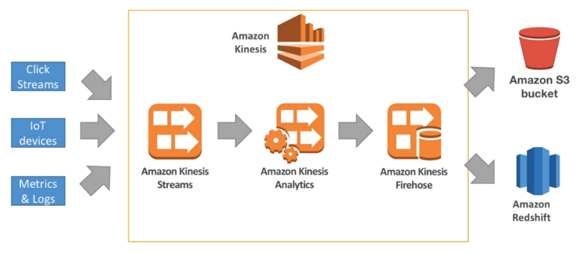|
|-|

It is a big data stream tool, which allows to stream application logs, metrics, IoT data, click streams, etc.

- Kinesis is a managed alternative to Apache Kafka
- Compatible with many streaming frameworks (Spark, NiFi, etc.)
- Data is automatically replicated to 3 AZ
- Kineses offers 3 types of products:
    - **Kinesis Streams**: low latency streaming ingest at scale
    - **Kinesis Analytics**: perform real-time analytics on streams using SQL
    - **Kinesis Firehose**: load streams into S3, Redshift, ElasticSearch

### Kinesis Streams

- Streams are divided in ordered Shards/Partitions
- For higher throughput we can increase the size of the shards
- Data retention is 1 day by default, can go up to 365 days
- Kinesis Streams provides the ability to reprocess/replay the data
- Multiple applications can consume the same stream, this enables real-time processing with scale of throughput
- Kinesis is not a database, once the data is inserted, it can not be deleted

**Kinesis Stream Shards**

||
|-|

- One stream is made of many different shards
- 1MB/s or 1000 messages at write PER SHARD
- 2MB/s read PER SHARD
- Billing is done per shard provisioned, we can have as many shards as we want as long as we accept the cost
- Ability to batch the messages per calls
- The number of shards can evolve over time (reshard/merge)
- **Records are ordered per shard!**

### Kinesis Data Firehose

- Fully managed service, no administration required, provides automatic scaling, it is basically serverless
- Used for load data into Redshift, S3, ElasticSearch and Splunk
- It is **Near Real Time**: 60 seconds latency minimum for non full batches or minimum 32 MB of data at a time
- Supports many data formats, conversions, transformation and compression
- Pay for the amount of data going through Firehose

**Kinesis Data Streams vs, Firehose**

- Streams:
    - Requires to write custom code (producer/consumer)
    - Real time (~200 ms)
    - Must manage scaling (shard splitting / merging)
    - Can store data into stream, data can be stored from 1 to 7 days
    - Data can be read by multiple consumers
- Firehose:
    - Fully managed, sends data to S3, Redshift, Splunk, ElasticSearch
    - Serverless, data transformation can be done with Lambda
    - Near real time
    - Scales automatically
    - It provides no data storage

### Kinesis Data Analytics

- Can take data from Kinesis Data Streams and Kinesis Firehose and perform some queries on it
- It can perform real-time analytics using SQL
- Kinesis Data Analytics properties:
    - Automatically scales
    - Managed: no servers to provision
    - Continuous: analytics are done in real time
- Pricing: pay per consumption rate
- It can create streams out of real-time queries

### AWS Kinesis API

#### Put Records

- Data must be sent form the PutRecords API to a partition key
- Data with the same key goes to the same partition (helps with ordering for a specific key)
- Messages sent get a sequence number
- Partition key must be highly distributed in order to avoid hot partitions
- In order to reduce costs, we can use batching with PutRecords API
- It the limits are reached, we get a *ProvisionedThroughputException*

|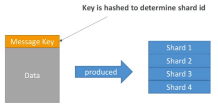|
|-|

#### Exceptions

- ProvisionedThroughputException Exceptions:
    - Happens when the data value exceeds the limit exposed by the shard
    - In order to avoid the, we have to make sure we don't have hot partitions
- Solutions:
    - Retry with back-off
    - Increase shards (scaling)
    - Ensure the partition key is good

#### Consumers

- Consumers can use CLI or SDK, or the Kinesis Client Library (in Java, Node, Python, Ruby, .Net)
- Kinesis Client Library (KCL) uses DynamoDB to checkpoint offsets
- KCL uses DynamoDB to track other workers and share work amongst shards

||
|-|

### AWS Kinesis CLI 

Sending data:

```bash
aws kinesis help
aws kinesis list-streams help
aws kinesis list-streams
aws kinesis describe-streams help
aws kinesis describe-streams --stream-name <name>  

## example
aws kinesis put-record --stream-name eden-stream-1 --data "Hello world. Please sign up." --partition-key user_123
aws kinesis put-record --stream-name eden-stream-1 --data "User has sign up." --partition-key user_123
aws kinesis put-record --stream-name eden-stream-1 --data "Registration complete." --partition-key user_123
```

Retrieving records:

```bash
aws kinesis help
aws kinesis get-shard-iterator help  
```

||
|-|

```bash
aws kinesis get-shard-iterator --stream-name <name> --shard-id <shard id> --shard-iterator-type TRIM_HORIZON 
```

||
|-|

```bash
aws kinesis get-records help 
```

||
|-|


### Security

- Control access / authorization using IAM policies
- Encryption in flight using HTTPS endpoints
- Encryption at rest using KMS
- Possibility to encrypt/decrypt data client side
- VPC Endpoints available for Kinesis to be access within VPCs


### Ordering data into Kinesis

- Data with the same partition key goes to the same shard
- Data is ordered per shard

### Ordering data into SQS 


## Summary - SQS vs SNS vs Kinesis

**SQS**

- Consumers pull data
- Data is deleted after being consumed
- Can have many consumers as we want
- No need to provision throughput
- No ordering guarantee in case of standard queues
- Capability to delay individual messages

**SNS**

- Pub/Sub: publish data to many subscribers
- We can have up to 10 million subscribers per topic
- Data is not persisted (it is lost if not delivered)
- Up to 10k topics per account
- No need to provision throughput
- Integrates with SQS for fan-out architecture

**Kinesis Data Streams**

- Consumers "pull data"
- We can have as many consumers as we want
- Possibility to replay data
- Recommended for real-time big data analytics and ETL
- Ordering happens at the shard level
- Data expires after X days
- Must provision throughput

## Amazon MQ 

- SQS and SNS are cloud-native, they are using proprietary protocols from AWS
- Traditional application running on on-premise may use queues with open protocols such as: MQTT, AMQP, STOMP, Openwire, WSS
- When migrating to cloud instead of re-engineering the application to SQS or SNS, we can use Amazon MQ
- Amazon MQ is basically managed Apache ActiveMQ
- Amazon MQ does not scale as much as SQS/SNS
- It runs on a dedicated machine, can urn in HA with failover
- It has both queue anf topic features

