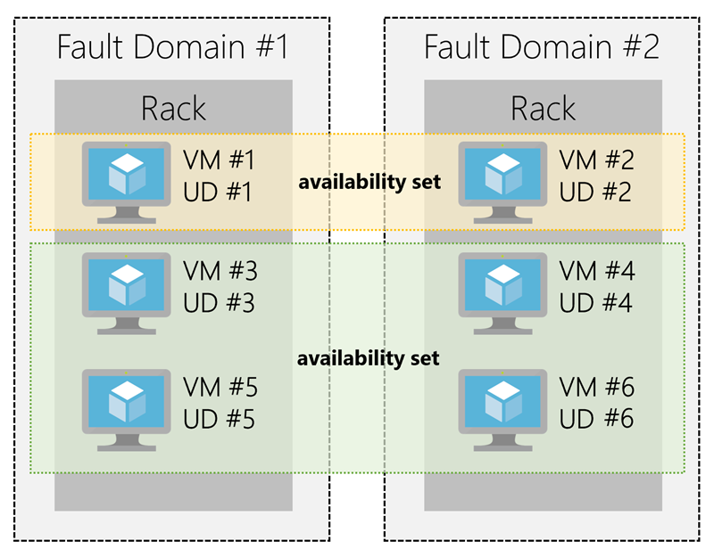
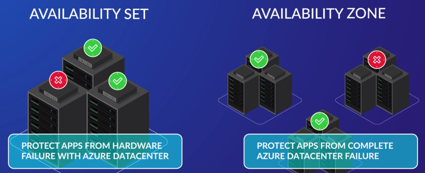

# Azure Compute 

> <small>This is not an exhaustive documentation of all the existing Azure Services. These are summarized notes for the Azure Certifications. To see the complete documentation, please go to: [Azure documentation](https://learn.microsoft.com/en-us/azure/?product=popular)</small>

- [Azure Compute](#azure-compute)
- [Virtual Machines](#virtual-machines)
- [Pre-requisite Resources](#pre-requisite-resources)
- [Pricing](#pricing)
- [VM Options](#vm-options)
- [Availability Sets](#availability-sets)
- [Resources](#resources)

## Compute Services 

Azure compute is an on-demand computing service for running cloud-based applications.

- Virtual machines
- Containers
- Azure App Service
- Serverless computing

This page will be focusing on virtual machines. 

## Virtual Machines 

Azure Virtual Machines (VMs) let you create and use virtual machines in the cloud. They provide infrastructure as a service (IaaS) in the form of a virtualized server and can be used in many ways.

- Commonly used for hosting applications, offering benefits of virtualization without managing physical hardware.
- Managing tasks such as configuration, patching, and software installation is necessary.

**Key uses and features of Azure virtual machines**

- Quick and easy setup, making them ideal for development and test environments.
- Pay-as-you-go nature allows organizations to host applications in Azure cost-effectively.
- Often employed to extend on-premises data centers to Azure using virtual networks and site-to-site VPNs.

**Considerations when designing an application infrastructure with Azure VMs**

- Establish virtual machine naming conventions.
- Deploy VMs in locations closest to users for optimal access.
- Determine VM sizing requirements and consider Microsoft Azure's CPU and VM quotas.
- Decide on the operating system and VM configuration needed for application requirements.

## Pre-requisite Resources 

To deploy an Azure virtual machine, certain prerequisite resources are essential. Generally, these resources will be automatically created if they do not exist prior to VM creation. Here are the key dependencies:

- **Resource Group**
   Must exist before creating a virtual machine, as each VM needs to be contained within a resource group.

- **Virtual Network and NIC**
   A virtual machine requires a virtual network, and consequently, a virtual Network Interface Card (NIC) for connectivity.

- **Storage Account (if using unmanaged disks)**
   Required to hold virtual hard disks for VMs using unmanaged disks. Not needed for VMs using only managed disks.

- **Public IP Address (for remote access)**
   Necessary if the virtual machine will be accessed remotely. If accessed only internally, a public IP address is not required.

- **Data Disks (optional but recommended)**
   While not mandatory, attaching data disks to a virtual machine is advisable to expand storage capabilities, especially if hosting applications.

## Pricing 

There are multiple purchasing options for Azure virtual machines:

- **Pay-as-You-Go**
   - Pay for compute capacity by the second.
   - No long-term commitments or upfront payments.
   - Flexible scalability—increase or decrease capacity as needed.
   - Recommended for customers seeking cost-effectiveness and flexibility.

- **Reserved VM Instances**
   - Involves an upfront commitment to purchase a virtual machine for one or three years.
   - Offers cost savings of up to 72% compared to pay-as-you-go pricing.
   - Suitable for applications with steady-state usage or for those seeking budget predictability.
   - Requires a commitment to using the VM for at least a year.

- **Spot Pricing**
   - Allows the purchase of unused Azure compute capacity at a discount of up to 90% compared to pay-as-you-go prices.
   - Workloads must tolerate interruptions, making it ideal for interruptible applications.
   - Not suitable for workloads that must adhere to strict SLAs.

Each option provides distinct advantages, catering to different usage scenarios and budget considerations.

## VM Options

Azure virtual machines come in various types, each tailored for specific workloads:

- **General-Purpose Virtual Machines:**
   - Balanced CPU to memory ratio.
   - Suitable for development, testing, small databases, and low-traffic web servers.

- **Compute-Optimized Virtual Machines:**
   - High CPU to memory ratios.
   - Ideal for medium traffic web servers, network appliances, batch processing, and application servers.

- **Memory-Optimized Virtual Machines:**
   - High memory to core ratios.
   - Used for relational database servers, large caches, and in-memory analytics.

- **Storage-Optimized Virtual Machines:**
   - High disk throughput and IO.
   - Perfect for big data, SQL, and NoSQL databases.

- **GPU Virtual Machines:**
   - Specialized for graphic rendering and video editing.
   - Available with single or multiple GPUs.

- **High-Performance Compute Virtual Machines:**
   - Fastest and most powerful CPU virtual machines.
   - Designed for high-performance compute workloads like molecular modeling, genomic research, and financial risk modeling.
   - Some include optional high throughput network interfaces.

Selecting the appropriate virtual machine type depends on the specific workload requirements and performance considerations.

## Availability Sets

 

**Availability Sets**
An availability set is a logical grouping of two or more VMs that help keep your application available during planned or unplanned maintenance.
- Provides redundancy and availability for virtual machines (VMs).
- Deploying at least two VMs ensures availability during maintenance.
- Qualifies for a VM SLA of 99.95% uptime.
- Update domains (up to 20) group VMs for sequential reboots during maintenance.
- Fault domains (up to 3) group VMs with a common power source and network switch.
- Protects against network outages, hardware failures, and power interruptions within an Azure data center.

**Availability Zones:**
Availability zones protect applications from the failure of an entire Azure data center.
- Protects applications from complete Azure data center failures.
- A unique physical location within an Azure region, with each zone containing at least one data center.
- Consists of fault domains (1) and update domains (1).
- Deploying VMs in an availability zone guarantees a 99.99% VM uptime SLA.
- Deploying three or more VMs across three zones ensures distribution across different fault and update domains.
- Used to safeguard applications from entire Azure data center failures.

**Scale Sets**
Azure Virtual Machine Scale Sets let you create and manage a group of identical, load balanced VMs.

## Resources 

- [Learning About Azure](https://cloudacademy.com/learning-paths/learning-about-azure-5663/)