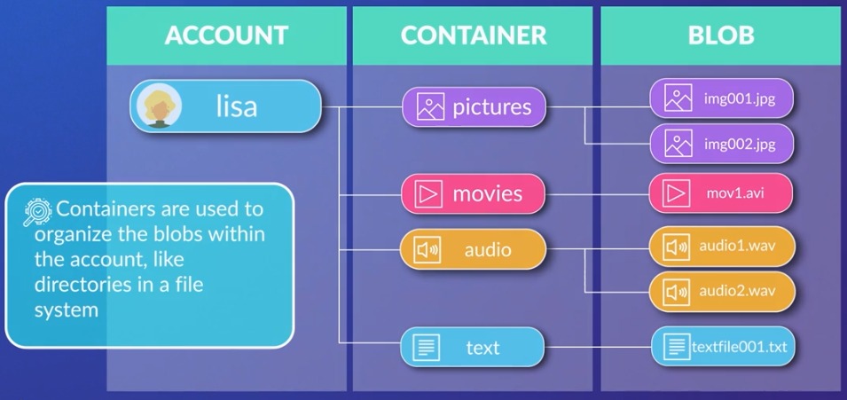

# Azure Storage 

> <small>This is not an exhaustive documentation of all the existing AWS Services. These are summarized notes for the Azure Certifications.</small>
> <small>To see the complete documentation, please go to: [Azure documentation](https://learn.microsoft.com/en-us/azure/?product=popular)</small>

- [Benefits of Azure Storage](#benefits-of-azure-storage)
- [Core Azure Storage Services](#core-azure-storage-services)
- [Storage Account types](#storage-account-types)
- [Azure Blob Storage](#azure-blob-storage)
- [Azure Files](#azure-files)
- [Azure Queues](#azure-queues)
- [Azure Table Storage](#azure-table-storage)
- [Azure Managed Disks](#azure-managed-disks)
- [Resources](#resources)

## Benefits of Azure Storage 

**Durability and Availability**
- Built-in redundancy ensures data safety during hardware failures.
- Cross-data center and cross-region replication protect against disasters or local failures.

**Security and Access Control**
- Automatic encryption for all stored data ensures inherent security.
- Fine-grained control over data access is maintained.

**Scalability and Accessibility**
- Designed to be massively scalable to meet diverse data storage requirements.
- Access data globally over HTTP or HTTPS with support for various client libraries and languages.
- Multiple access methods include .NET, Java, Python, PHP, PowerShell, Azure CLI, Azure portal, and Azure Storage Explorer.

## Core Azure Storage Services

**Azure Blobs**
- Provides object storage for unstructured data (e.g., text, binary data).

**Azure Managed Disks**
- Block-level storage volumes managed by Azure for virtual machines.
- Types include ultra disks, premium SSD disks, standard SSD disks, and standard HDD disks.

**Azure Files**
- Fully managed file share system accessible via the SMB protocol.
- Supports mounting from Windows, Linux, and MacOS machines, on-prem and in the cloud.

**Azure Queue Storage**
- Designed for storing and managing large numbers of messages in distributed applications.

**Azure Table Storage**
- Ideal for structured NoSQL data with a key/attribute store and a schema-less design.

## Storage Account types

1. **General-Purpose V2 Account**
   - Basic storage account suitable for hosting blobs, files, queues, and tables.
   - Recommended for most scenarios requiring Azure storage.
  
2. **General-Purpose V1 Account**
   - Legacy account hosting blobs, files, queues, and tables.
   - Similar functionality to V2 accounts, but Microsoft recommends using V2 for future-proofing.

3. **Block Blob Storage Account**
   - Offers premium performance for block blobs and append blobs.
   - Ideal for high transaction rates and scenarios requiring low storage latency.

4. **File Storage Account**
   - Exclusive files-only storage account.
   - Recommended for enterprise and high-performing applications.

5. **Blob Storage Account**
   - Legacy account used for blob-only storage.
   - Microsoft recommends using general-purpose V2 accounts instead.

**Key Features**
- All storage account types are encrypted using Storage Service Encryption (SSE) for data at rest.
- Archive storage and blob-level tiering support only block blobs.
- Zone-Redundant Storage (ZRS) and Geo Zone-Redundant Storage (GZRS) are available for standard general-purpose V2 accounts, block blob accounts, and file storage accounts in certain regions.
- Premium performance for general-purpose V2 and general-purpose V1 accounts is available for disk storage and page blobs. For block blobs and append blobs, it's exclusive to block blob accounts. Files-only storage accounts support premium performance for files.

**Important Points**
- Archive storage and blob-level tiering support only block blobs.
- ZRS and GZRS are available only for standard general-purpose V2 accounts, block blob accounts, and file storage accounts in certain regions.
- Premium performance for general-purpose V2 and general-purpose V1 accounts is only for disk storage and page blobs. Block blob accounts support premium performance for block blobs and append blobs, and files-only storage accounts support premium performance for files.

Detailed information on the different storage accounts available at: [https://docs.microsoft.com/en-us/azure/storage/common/storage-account-overview](https://docs.microsoft.com/en-us/azure/storage/common/storage-account-overview).

## Azure Blob Storage 

Azure Blob storage is an object storage solution designed for storing massive amounts of unstructured data, including text and binary data. 

- Commonly used to host images, documents for web browsing, stream video or audio, store log files, backups, archive data, and data for analysis by on-prem or Azure-hosted processes.
- Objects in Blob storage can be accessed using HTTP or HTTPS.
- Accessible through Azure Storage REST API, Azure PowerShell, Azure CLI, or Azure storage client libraries (Java, PHP, .NET, etc.).

**Key Resources**

1. **Storage Account**
   - Creates a unique namespace in Azure for accessing data.
   - Forms the base address for objects in the storage account.
   - Example URL: `http://mystorage.blob.core.windows.net` for a storage account named MyStorage.

2. **Containers**
   - Used to organize blobs within a storage account, akin to directories in a file system.
   - Unlimited containers within a storage account, each capable of storing an unlimited number of blobs.

3. **Blob Types**
   - **Block Blobs**
     - Can store up to about 190.7 TiB of text and binary data.
     - Consists of manageable blocks of data, hence the name.
   - **Append Blobs**
     - Optimized for append operations.
     - Suitable for logging data from virtual machines.
   - **Page Blobs**
     - Used for storing random access files up to 8 TiB.
     - Ideal for storing VHD files, serving as disks for Azure virtual machines.

**Resource Relationship**
- The storage account, containers, and blobs have a hierarchical relationship, forming a structured organization for your data.

**For More Information**
To learn more about blob storage, refer to the official documentation at [Azure Blob Storage Introduction](https://docs.microsoft.com/en-us/azure/storage/blobs/storage-blobs-introduction).

## Azure Files 

Azure Files makes file shares available in the cloud, offering a fully managed solution.

- Supports access through the **Server Message Block (SMB) protocol**, an industry-standard. 
- Azure file shares can be mounted from Windows, Linux, and Mac OS machines, both in the cloud and on-premises.
- **Azure File Sync** Allows caching Azure file shares on Windows servers close to users for faster data access.
- Azure Files can replace or supplement on-premises file servers and NAS devices.
- Enables control of Azure file share permissions through on-prem Active Directories. 
- Useful for lifting and shifting applications to the cloud, especially those relying on file shares for data storage.
 
**Management and Operations**
- **Fully Managed**: Azure Files is a fully managed service, eliminating concerns about hardware management, OS installation, patching, and security upgrades.
- **Command Line and Portal Management:**
    - Use familiar PowerShell commands and Azure CLI commands for creating, mounting, and managing Azure file shares.
    - Management through the Azure portal and Azure Storage Explorer is also supported.

**Resilience and Reliability**

- **Built to Be Resilient:** Azure Files is designed with resilience, eliminating worries about file server upgrades, local power outages, and network issues affecting on-prem file shares.

By leveraging Azure Files, organizations can simplify file storage management, enhance accessibility, and ensure reliability without the overhead of traditional on-premises file servers. 

## Azure Queues 

Azure Queue Storage provides a scalable and reliable solution for managing messages in distributed applications, enhancing communication and coordination among various system components.

- Messages are not emails but serve as communication units in distributed applications.
- Accessible globally through authenticated HTTP or HTTPS calls.

**Components of Azure Queue Service**

1. **URL Format** 
    - Specific URL format required to access a queue, including the storage account name and queue name.
    - Example URL: `http://mystorageaccount.queue.core.windows.net/images-to-process`
2. **Storage Account:**
   - All access to Azure storage services, including queues, is through a storage account.
   - The storage account acts as the overarching container for Azure storage.

3. **Queue** 
    - A queue is essentially a set of messages.
    - When naming a queue, use all lowercase letters.

4. **Message**
    - Messages can be in any format. and can be up to 64 kB in size.
    - Messages play a crucial role in enabling communication between different components of a distributed application.

## Azure Table Storage 

Azure Table Storage is a NoSQL datastore, providing a schema-less and flexible approach to storing structured non-relational data. 

- Ideal for storing structured non-relational data.
- Key/attribute store with a schema-less design, allowing flexibility in data storage without rigid schema requirements.
- Commonly used for flexible databases, such as user data in web applications, address books, or device information.
- Suited for scenarios with large amounts of structured data, especially when complex joins, foreign keys, or stored procedures are not necessary.
- Useful for scenarios involving large datasets that require fast access without the need for complex relational features. 

**Components of Azure Table Storage**

1. **URL Format for Access:**
   - Format: `http://<storage account>.table.core.windows.net/<table>`
   - Unique URL with storage account name and table name.
2. **Storage Account:**
   - All access to Azure storage, including table storage, is via a storage account.
3. **Table:**
   - A collection of entities; unlike relational databases, tables do not enforce a strict schema.
4. **Entity:**
   - Comparable to a traditional database row.
   - Essentially, a set of properties.
   - Each entity can be up to 1 MB in size.
5. **Properties:**
   - Name-value pairs.
   - Up to 252 properties per entity.
   - Three system properties: 
        - partition key
        - row key
        - timestamp

**Key Relationships**

- **Hierarchy:** Storage account > Tables > Entities > Properties.
- **Access:** The URL serves as the means to access the entire structure.

## Azure Managed Disks 

Azure Managed Disks provide a virtualized, scalable, and highly available storage solution for Azure VMs. 

- Virtualized block-level storage volumes used with Azure VMs and managed by Microsoft Azure.
- The encryption options (SSE and ADE) enhance data security, and the distinction between data, OS, and temporary disks allows for efficient and purpose-driven disk management within the Azure infrastructure.

**Benefits**

  1. **Availability**
        - Designed for 99.999% availability with three replicas of data per disk, protecting against two failures of disk replicas.
  2. **Scalability**
        - Supports up to 50,000 VM disks of a specific type per region in each subscription, enabling the creation of numerous virtual machines.
  3. **Integration:**
        - With availability sets: 
            - Isolation of VM disks within an availability set, guarding against a single point of failure within an Azure data center.
        - With availability zones: 
            - Protection against entire Azure data center failures.
  4. **Backup and Restore**
        - Integrated with Azure backup, supporting backup and restore of managed disks, making VM restores easy.
  5. **Access Control** 
        - Granular access control through Azure role-based access control (RBAC), allowing specific permissions for managed disks.
  6. **Upload Ease** 
        - Facilitates the upload of on-prem VMs to Azure through direct upload, streamlining the VHD file transfer process.

**Encryptions**

  1. **Server-side Encryption (SSE)**
     - Default for all managed disks.
     - Provides encryption at rest for data, snapshots, and images.
  2. **Azure Disk Encryption (ADE)**
     - Enables encryption on OS and data disks of a VM.
     - Uses **BitLocker** for Windows VMs 
     - Used **DM-crypt** for Linux VMs.

**Disk Types**

  1. **Data Disks**
     - Attached to a VM to store applications and data.
     - Registered as a SCSI drive, assignable drive letters, 
     - Max capacity of 32 terabytes.
     - Number of data disks depends on VM size.
  2. **OS Disks**
     - Deployed with a VM, hosts OS and boot volume.
     - Max capacity of 4 terabytes.
  3. **Temporary Disks**
     - Not a managed disk, not intended for important data.
     - Every VM contains a temporary disk, 
     - Used for page files and swap files, 
     - Data may be lost during maintenance events or VM redeployment.
     - Assigned the drive letter D on Windows and 
     - Assigned to /dev/sdb on Azure Linux VMs.

## Resources 

- [Learning About Azure](https://cloudacademy.com/learning-paths/learning-about-azure-5663/)