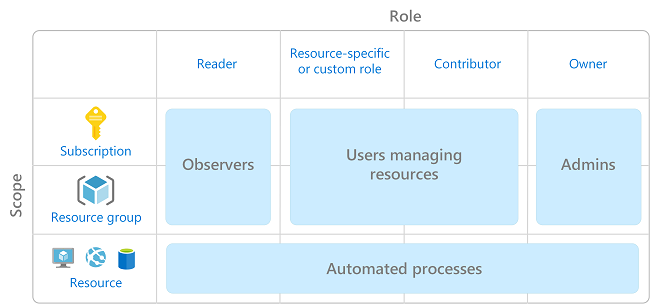
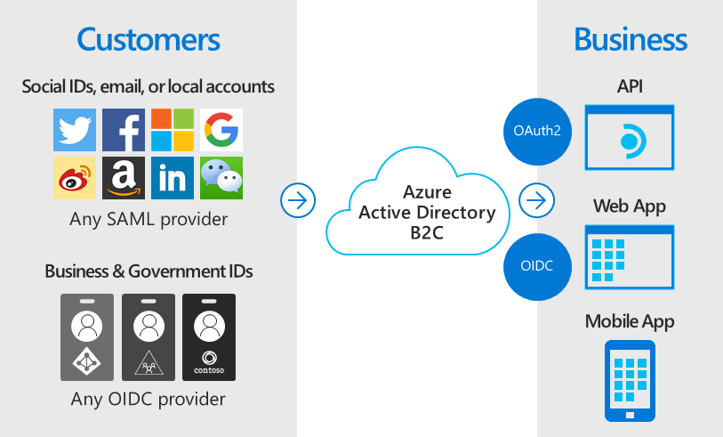
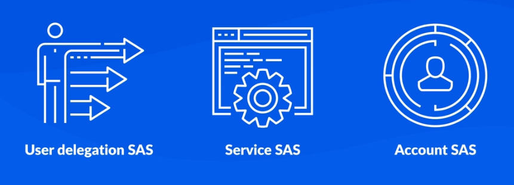
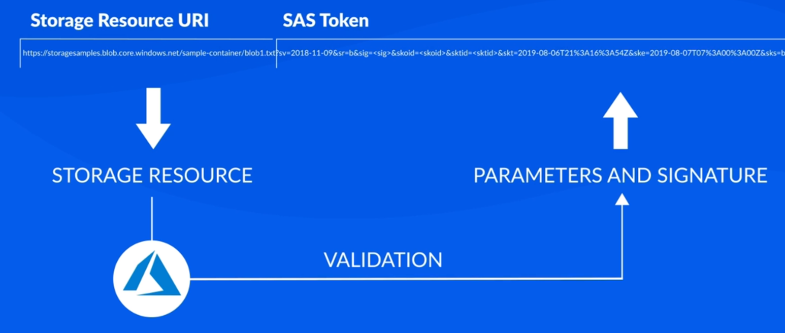

# Azure Security 

> <small>This is not an exhaustive documentation of all the existing Azure Services. These are summarized notes for the Azure Certifications. To see the complete documentation, please go to: [Azure documentation](https://learn.microsoft.com/en-us/azure/?product=popular)</small>

- [Shared Responsibility Model](#shared-responsibility-model)
- [Azure Security Services](#azure-security-services)
    - [Microsoft Defender for Cloud](#microsoft-defender-for-cloud)
    - [Azure Key Vault](#azure-key-vault)
    - [Azure Monitor](#azure-monitor)
    - [Azure Sentinel](#azure-sentinel)
- [Identity and Access Management](#identity-and-access-management)
    - [Role-Based Access Control RBAC](#role-based-access-control-rbac)
    - [Microsoft Entra ID previously "Azure Active Directory"](#microsoft-entra-id-previously-azure-active-directory)
    - [Azure AD Services](#azure-ad-services)
    - [Azure Multi-Factor Authentication MFA](#azure-multi-factor-authentication-mfa)
- [Networking Security](#networking-security)
    - [Network Security Groups NSG](#network-security-groups-nsg)
    - [Azure VPN Gateway](#azure-vpn-gateway)
    - [Azure ExpressRoute](#azure-expressroute)
    - [Web Application Firewall WAF](#web-application-firewall-waf)
    - [Azure Firewall](#azure-firewall)
    - [Azure DDoS Protection](#azure-ddos-protection)
    - [Virtual Network Service Endpoints](#virtual-network-service-endpoints)
- [Storage Security](#storage-security)
    - [Azure Storage Service Encryption](#azure-storage-service-encryption)
    - [Shared Access Signatures SAS](#shared-access-signatures-sas)
    - [Storage Account Keys](#storage-account-keys)
    - [Azure Storage Analytics](#azure-storage-analytics)
- [Database Security](#database-security)
    - [Azure SQL Firewall Rules](#azure-sql-firewall-rules)
    - [Azure SQL Always Encrypted](#azure-sql-always-encrypted)
    - [Azure SQL Transparent Data Encryption TDE](#azure-sql-transparent-data-encryption-tde)
    - [Azure SQL Database Auditing](#azure-sql-database-auditing)
- [Dynamic Data Masking in Azure SQL](#dynamic-data-masking-in-azure-sql)
    - [Use Case](#use-case)
    - [Configuration](#configuration)
    - [Masking Functions](#masking-functions)
- [Resources](#resources)

## Shared Responsibility Model

The shared responsibility model outlines the distribution of security responsibilities between the organization and the cloud provider (Microsoft) based on the hosting environment (on-premises or cloud) and workload type (SaaS, IaaS, PaaS). 
- Critical for organizations considering a move to the cloud.
- Defines security tasks handled by the cloud provider (Microsoft) and those handled by the organization.

**On-Premises**

- **Customer Responsibility:**
    - Responsible for all aspects of security and operations.
    - Complete ownership and control over security and operational aspects.

**IaaS (Infrastructure as a Service)**
  
- **Cloud Provider Responsibility:**
    - Tangible aspects (servers, network hardware).
    - Hypervisor and physical datacenters.

- **Customer Responsibility:**
    - Securing and managing operating systems on servers.
    - Network configurations.
    - Deployed applications.
    - Identity management.
    - Data security.

**PaaS (Platform as a Service)**

- **Cloud Provider Responsibility:**
    - Responsibilities from IaaS.
    - Additional responsibility for managing and securing network controls.
    - Cloud provider assumes more responsibilities compared to IaaS.

- **Customer Responsibility:**
    - Partial responsibility for securing and managing applications.
    - User identities.
    - Data.

**SaaS (Software as a Service)**

- **Cloud Provider Responsibility:**
    - Extensive responsibility as the provider delivers the application as a service.

- **Customer Responsibility:**
    - Focus on ensuring proper data classification.
    - Shared responsibility for managing users and endpoint devices.
    - Provider handles underlying components, emphasizing service delivery.

<small>[Back to the top](#azure-security)</small>

## Azure Security Services 

These Azure security services collectively provide a comprehensive approach to securing workloads, managing secrets, monitoring and analyzing data, and responding to security threats across the enterprise.

### Microsoft Defender for Cloud

Microsoft Defender for Cloud is a security posture management and threat protection tool that is designed to protect workloads, track security posture, and streamline security management.

**Secure Score**
- Aggregated value representing security posture.
- Higher score indicates lower identified risk.

    

    
    

**Security Recommendations**
- Guidance and tasks to harden resources.
- Implement within Defender for Cloud.

**Security Alerts**
- Identifies threats and generates alerts.
- Alerts can be viewed in Azure portal or sent via email.

**Defender Features**

- **Microsoft Defender for Servers**
    - Advanced feature in Defender for Cloud that allows you to add threat detection to both Windows Machines and Linux machines, whether they're in Azure, on-prem, or in a multi cloud environment.

- **Defender for Storage**
    - Detects attempts to access or exploit storage accounts and provides you with security alerts and recommendations.

- **Defender for SQL**
    - Discovers and helps mitigate database vulnerabilities

- **Microsoft Defender for Containers**
    - Cloud-native solution for securing containers.

- **Microsoft Defender for App Service**
    - identifies attacks that target apps running on the app service

- **Defender for Key Vault**
    - Protects your key vaults by detecting unusual attempts to access them.

- **Defender for Resource Manager**
    - Automatically monitor resource management operations that happen within the organization.
    - Monitors these operations whether they're performed via the Azure portal, or the Azure CLI, Azure Rest APIs, or via other Azure programmatic clients.
    - Detects threats and alerts you about suspicious activity that it identifies.

- **Defender for DNS**
    - Detects suspicious activities like:
        - DNS attacks
        - Communications with domains used for malicious activities like phishing or crypto mining
    - Identify malware that's communicating with its control servers.
    - Detect data exfiltration from Azure resources through DNS tunneling.
    
- **Microsoft Defender Open-Source Relational Databases**
    - Provide alerts when it detects suspicious database access and query patterns, or when it detects suspicious database activities.

<small>[Back to the top](#azure-security)</small>

### Azure Key Vault

Azure Key Vault is a cloud solution for centrally storing and managing secrets, keys, certificates.

- Securely store things like tokens and passwords
- Key management for encryption keys
- Provision, manage, deploy TLS/SSL certificates
- Designed in such a way that Microsoft cannot, and does not, extract your data

**Authentication and Authorization**
- Authentication by Azure Active Directory.
- Authorization via role-based access control (RBAC) or Key Vault access policies.
- Supports hardware security modules (HSMs) and FIPS 140-2 Level 2 validated HSMs.

<small>[Back to the top](#azure-security)</small>

### Azure Monitor

Azure Monitor collects resource and activity logs and other monitoring data that can be analyzed to provide information on all resources across your entire environment.

**Events**
- Typically created by applications or services you are running 
- Usually provide information indicating when a specific resource was created or modified or when an error was detected in an application

**Features**

1. **Log Analytics:**
   - Used to write log queries and analyze log data.
   - Enables querying and extracting insights from collected log information.

2. **Data Explorer Analysis Engine:**
   - Interactively analyze log data.
   - Provides a powerful engine for working with large datasets.

3. **Application Insights Analytics Console:**
   - Located in the Azure portal.
   - Allows writing log queries and interactively analyzing log data.
   - Primarily used for application performance monitoring.

4. **Visualization:**
   - Render log data as tables or charts.
   - Pin visualizations to the Azure dashboard for quick access.

5. **Workbooks:**
   - Create workbooks to combine multiple sets of data into a single report.
   - Customize and organize data visualizations for better insights.

6. **Alert Rules:**
   - Configure log alert rules based on query results.
   - Receive notifications or trigger automated actions when defined conditions are met.

7. **Access Tools:**
   - Utilize various tools to access log query results.
     - Azure CLI
     - Azure PowerShell
     - REST API
     - Custom applications

8. **Building Workflows:**
   - Use Azure Monitor Logs to build workflows.
   - Retrieve log data and copy it to external locations using tools like Logic Apps.

<small>[Back to the top](#azure-security)</small>

### Azure Sentinel

Azure Sentinel is a cloud-based security information event management (SIEM) solution. All-in one solution for:

- Intelligent security analytics
- Threat intelligence
- Alert detection
- Threat visibility
- Proactive hunting
- Threat response.

**Features**

- Determines scope and root causes of potential security threats.
- Proactively hunt for security threats.
- Built-in automation and orchestration of common tasks.
- Integration with Azure technologies (logic apps, log analytics, AI).
- Community-provided workbooks, playbooks, hunting queries.

**Onboarding Sentinel**
- Connect it first to existing data sources.
- Available connectors for Microsoft solutions and other sources.
- After connecting, monitor your data with  .

<small>[Back to the top](#azure-security)</small>

## Identity and Access Management 

Azure provides a comprehensive suite of access management and identity services, allowing organizations to tailor their security measures based on specific needs. 

- Role-Based Access Control (RBAC) ensures granular control over resource Access.
- Azure AD facilitates secure identity and access management for users, applications, and external collaborations. 
- Additionally, services like Azure AD DS and Azure MFA enhance security and streamline authentication processes.

### Role-Based Access Control (RBAC)

RBAC is an authorization system built on Azure Resource Manager, providing fine-grained access management for Azure resources.
- Manages user access to specific Azure resources, defining their permissions and scope.
- Enables segregation of duties, granting users the least privilege needed for their tasks.
- Minimizes security risks by granting least privilege.
- Effective in complex organizations with diverse resource needs.

**Example Scenario**
  - Allow different user groups to manage distinct resources (e.g., VMs, virtual networks, SQL databases) based on their roles.
  - Enables segregation of duties within your organization by allowing only the least amount of access that is needed by users to do their jobs.

<small>[Back to the top](#azure-security)</small>

### Microsoft Entra ID (previously "Azure Active Directory")

Cloud-based identity and access management service by Microsoft which allows you to control access to internal and external resources. Applicable to IT Admins, App Developers, and service subscribers.

**Usage**

- IT Admins: 
   - Control access to applications
   - Enforce multi-factor authentication
   - Automate user provisioning.

- App Developers: 
   - Add single sign-on to applications.

- Subscribers: 
   - Automatic Azure AD tenants for services like Microsoft 365, Office 365, and Azure.

<small>[Back to the top](#azure-security)</small>

### Azure AD Services

**Azure AD B2B (Business-to-Business)**
- Enables secure sharing of apps and services with guest users from external organizations, while allowing them to retain control over their data.
- Provides an easy-to-use invitation and redemption process for external users to use their own credentials to access partner resources.

    

**Azure AD B2C (Business-to-Customer)**
- Offers identity as a service for customer access via single sign-on.
- Supports standards-based authentication protocols::
    - OpenID Connect
    - OAuth 2.0
    - SAML
- Integrates with various applications and commercial software.

    

**Azure AD Domain Services (Azure AD DS)**
- Cloud offering providing managed domain services compatible with on-prem Active Directory.
- Eliminates the need for deploying, managing, or patching domain controllers.
- Access to resources can be controlled through existing groups and user accounts.
- Replicates identity information from Azure AD or synchronizes from on-prem Active Directory.
- Use Azure AD Connect to sync on-prem AD with you Azure AD Domain Services.
- Features include:
    - Domain Join
    - LDAP
    - Kerberos
    - NTLM Authentication
    - Group Policy support

    

<small>[Back to the top](#azure-security)</small>

### Azure Multi-Factor Authentication (MFA)

Two-step verification for enhanced security, requiring multiple authentication methods.
- Combines the following:
    - something the user knows (password), 
    - something they possess (e.g., smartphone), and 
    - something they are (biometrics).
- Usage:
   - Protects data and applications without compromising user experience.
   - Included in Azure AD Premium, Microsoft 365 Business, Azure AD Free, and standalone Office 365 licenses.
   - Additional features in premium versions, including Conditional Access policies.
    

    

<small>[Back to the top](#azure-security)</small>

## Networking Security

Azure offers a robust suite of services for network security, providing solutions for:
- filtering traffic, 
- establishing secure connections,
- protecting web applications,
- and mitigating DDoS attacks. 

These services cater to diverse needs, ensuring the security and reliability of Azure resources and connections.

### Network Security Groups (NSG)

Used to filter network traffic to and from Azure resources connected to a virtual network.

  - Default security rules control inbound and outbound traffic 
  - You can create as many custom rules as you need.
  - Defines allowed or denied traffic based on source, destination, and port.
  - Enhances security by controlling communication between resources.
   

    

    
    

For more information: [Azure services compatible with NSG](https://docs.microsoft.com/azure/virtual-network/virtual-network-for-azure-services).

<small>[Back to the top](#azure-security)</small>

### Azure VPN Gateway

Virtual network gateway facilitating encrypted traffic between Azure virtual networks, on-premises networks, or remote users.

  - Sents encrypted traffic over public Internet.
  - Supports multiple connections to a single gateway.
  - Deployed with specialized VMs in a dedicated subnet (gateway subnet).
  - Supports VNet-to-VNet, Site-to-Site, and Point-to-Site connections.
   

    

    
    

**Virtual Network Gateway**

When a virtual network gateway is deployed, Azure provisions two or more specialized VMs under the covers. 

- These specialized VMs are not accessible
- They are deployed to a special subnet that you create. 
- This special subnet is called the **gateway subnet**. 
- The specialized VMs that get deployed contain routing tables and they run specific gateway services. 

You can deploy VPN gateways in Azure Availability Zones so they can benefit from the resiliency, scalability, and higher availability that Availability Zones provide.

Once you’ve deployed a VPN gateway, you can:

- Create an IPsec/IKE VPN connection between the VPN gateway and another endpoint, which could be another VPN gateway (to form a VNet-to-VNet connection).
 

    

    
    

 

- Create an IPsec/IKE VPN connection between the VPN gateway and an on-prem VPN device (to create a Site-to-Site connection). 

- You could also create a Point-to-Site VPN connection that allows you or your users to connect to the virtual network from a remote location.

For more information: [Azure VPN Gateway Documentation](https://docs.microsoft.com/azure/vpn-gateway/vpn-gateway-about-vpngateways)

<small>[Back to the top](#azure-security)</small>

### Azure ExpressRoute

Private, dedicated connection between on-premises networks and Microsoft Cloud services.

  - Traffic goes through connectivity providers for a secure and reliable connection.
  - Layer 3 connectivity with any-to-any, point-to-point, or virtual cross-connection options.
  - Global connectivity across geopolitical regions.
  - Dynamic BGP routing, built-in redundancy.

    

    
    

    For more information: [Azure ExpressRoute FAQs](https://docs.microsoft.com/azure/expressroute/expressroute-faqs)

<small>[Back to the top](#azure-security)</small>

### Web Application Firewall (WAF)

Provides centralized protection for web applications against malicious attacks.

- Simplifies security management by patching known vulnerabilities centrally.
- Included in Application Gateway service and Front Door service.
 

    

    
    

    For more information: [Web Application Firewall Overview](https://docs.microsoft.com/azure/web-application-firewall/overview)

<small>[Back to the top](#azure-security)</small>

### Azure Firewall

Cloud-based network security service for protecting Azure Virtual Network resources.
  
  - Fully stateful firewall as a service, with built-in high availability and unrestricted cloud scalability.
  - Centrally creates, enforces, and logs application and network connectivity policies.
  - Uses a static public IP address for easy identification of traffic from the virtual network.
  - Integrated with Azure Monitor for logging and analytics.
   

    

    
    

For more information: [Azure Firewall Documentation](https://docs.microsoft.com/azure/firewall/)

<small>[Back to the top](#azure-security)</small>

### Azure DDoS Protection

A distributed denial of service attack, or **DDoS attack**, can wreak havoc on an internet-facing application. It’s a real concern for organizations who are considering moving their workloads to the cloud because DDoS attacks can be leveled at any internet-facing endpoint.

To help mitigate these threats, you can leverage Azure DDoS Protection. By combining this service with solid application design, you can protect yourself from dangerous DDoS attacks

**DDoS Tiers**

- **Basic Tier:**
   - Automatically enabled in the Azure platform.
   - Provides always-on traffic monitoring and real-time mitigation of common network-level attacks.

- **Standard Tier:**
   - Offers additional mitigation capabilities.
   - Mitigate volumetric attacks.
   - Configurable protection policies with dedicated traffic monitoring and machine learning.

**Implementation**
  - Apply protection policies to public IP addresses associated with resources.
  - Protects against volumetric, protocol, and application-layer attacks.

For more information: [Azure DDoS Protection Overview](https://docs.microsoft.com/azure/virtual-network/ddos-protection-overview)

<small>[Back to the top](#azure-security)</small>

### Virtual Network Service Endpoints

Extends the private address space of an Azure virtual network.
- Extends the identity of a virtual network to Azure services over a direct connection.
- Locks down Azure service resources to only virtual networks.
- Allows routing of service traffic from your virtual network directly to the Azure service.
- Allows auditing and monitoring of outbound Internet traffic through **forced-tunneling** without impacting service traffic.

For more information: [Virtual Network Service Endpoints Overview](https://docs.microsoft.com/azure/virtual-network/virtual-network-service-endpoints-overview)

<small>[Back to the top](#azure-security)</small>

## Storage Security

<small>[Back to the top](#azure-security)</small>

These security options collectively enhance the protection, management, and monitoring of data stored in Azure Storage. Each option addresses specific aspects of security, access control, and logging for a comprehensive storage security strategy.

### Azure Storage Service Encryption

Automatically encrypts data in Azure Storage to meet security and compliance requirements.

- Enabled by default when creating a new storage account; cannot be disabled.
- Uses 256-bit AES encryption.
- Supported on Standard and premium storage accounts.
- No impact on Azure Storage performance.
- No additional cost for Azure Storage encryption.
- Resources Encrypted: Blobs, disks, files, queues, and tables, including metadata.

For more information: [Azure Storage Service Encryption](https://docs.microsoft.com/azure/storage/common/storage-service-encryption)

<small>[Back to the top](#azure-security)</small>

### Shared Access Signatures (SAS)

Provides secure granular access to storage resources without compromising data security.

**Types**

- **User Delegation SAS:** 
    - Applies to Blob storage
    - Secured with Azure AD credentials
    - Microsoft recommends to use Azure AD credentials whenever possible to enhance security

- **Service SAS:** 
    - Secured with the storage account key
    - Used to delegate access to a specific service (Blob, Queue, Table, or Azure Files)

- **Account SAS:** 
    - Secured with the storage account key
    - Used to delegate access to one or more storage services

**How SAS works** 

- SAS is a signed URI with a special token and query parameters, including a signature.
- SAS URI is then presented to Azure Storage as part of a request
- Azure checks SAS parameters and signature for validity; declines unauthorized requests.

<small>[Back to the top](#azure-security)</small>

### Storage Account Keys

When you create a storage account, Azure generates two 512-bit keys which you can use to authorize access to data that resides in your storage account via Shared Key authorization.

- Use Azure Key Vault to manage, rotate, and regenerate the keys
- Regularly rotate and regenerate keys
- Key rotations can be performed without interrupting the applications that use them
- Storage accoun access are essentially root passwords; protect them by not distributing, saving in plain text, or hard coding in apps.

<small>[Back to the top](#azure-security)</small>

### Azure Storage Analytics

Performs logging and provides metrics data for storage accounts.

- Ideal for tracing storage requests, analyzing usage trends, diagnosing storage account issues.
- Needs to be enabled for each service to monitor storage requests and analyze usage trends.
- 20TB limit for stored data, independent of the total storage account limit.

For more information: [Azure Storage Analytics](https://docs.microsoft.com/en-us/azure/storage/common/storage-analytics)

<small>[Back to the top](#azure-security)</small>

## Database Security

These security options provide a comprehensive approach to securing Azure SQL Databases, offering controls at various levels and addressing different aspects of data protection, access control, and auditing. 

Properly configuring and utilizing these features enhances the overall security posture of database environments on Azure.

<small>[Back to the top](#azure-security)</small>

### Azure SQL Firewall Rules

Controls access to the Azure SQL Database server's public endpoint through IP firewall rules.

- Access to the public endpoint for the server are automaticaly blocked when you create a new Azure SQL server
- Has Server-level and Database-level Firewall rules

**Levels**

- **Server-level IP Firewall Rules:** 
   - Allow access to the entire Azure SQL server, covering all hosted databases.
   - Created for the entire server, regardless fo how many databases it holds
   - Master database holds these rules.
   - Max of 128 rules.

- **Database-level IP Firewall Rules:** 
   - Allow access to specific databases on the SQL Database server. 
   - Created for each database, including the master database
   - Max of 128 rules per database.

For more information: [SQL Database Firewall Rules Configuration](https://docs.microsoft.com/azure/sql-database/sql-database-firewall-configure)

<small>[Back to the top](#azure-security)</small>

### Azure SQL Always Encrypted

Encrypts sensitive data (e.g., credit card numbers) within client applications, ensuring separation of data owners and managers.

- Clients encrypt sensitive data before sending it to SQL Server, with decryption done transparently on query results.
- Ensures unauthorized users, inclduing database admins, can't access sensitive data.
- Driver needs to be installed on te computer, which then automatically encrypts/decrypts data
- Available in all editions of Azure SQL Database since SQL Server 2016.

For more information: [Always Encrypted Documentation](https://docs.microsoft.com/sql/relational-databases/security/encryption/always-encrypted-database-engine)

<small>[Back to the top](#azure-security)</small>

### Azure SQL Transparent Data Encryption (TDE)

Encrypts Azure SQL Databases, Azure SQL Managed Instances, and Azure Synapse data at rest to protect against offline attacks.

- Real-time encryption/decryption of database, backups, and transaction log files without application changes
- Enabled by default for newly deployed Azure SQL databases
- However, it cannot be used to encrypt the logical master database because it needs objects that TDE needs to perform the encryption
- Manual enabling required for older databases

For more information: [Transparent Data Encryption Documentation](https://docs.microsoft.com/azure/sql-database/transparent-data-encryption-azure-sql)

<small>[Back to the top](#azure-security)</small>

### Azure SQL Database Auditing

Azure SQL Database Auditing tracks database events, logging them to an audit log hosted in Azure storage, Log Analytics, or Event Hubs. It facilitates regulatory compliance, monitors database activity, identifies anomalies, and detects security violations.

**Configuration**

- **Database-Level Auditing:** 
   - Specific to a database
   - Can be defined in a default server policy for all databases

- **Server-Level Blob Auditing:** 
   - Audits all databases on the server
   - Auditing always applies regardless of any database-level settings
   
**Considerations** 
- When both Database Auditing and Server Blob Auditing is enabled, both audits will exist separately
- Avoid simultaneous enabling of both server blob auditing and database blob auditing, unless:
    - Each used a different storage account
    - Each database will have different retention period
- Recommended to enable server-level blob auditing only, unless there's a specific need for database-level auditing  

<small>[Back to the top](#azure-security)</small>

## Dynamic Data Masking in Azure SQL

Dynamic Data Masking (DDM) is a technology supported by Azure SQL Database, Azure SQL Managed Instance, and Azure Synapse Analytics. 

- Limits exposure to sensitive data by dynamically masking it for users who lack the necessary permissions
- DDM operates as a policy-based security feature, concealing specific sensitive data returned from database queries 
- DDM hides sensitive data without altering the data stored in the database.

<small>[Back to the top](#azure-security)</small>

### Use Case

An example scenario for DDM involves a call center employee who needs to identify a caller by confirming the last four digits of their social security number. 

- The employee doesn't require access to the entire social security number 
- DDM allows the definition of masking rules to hide sensitive data in query result sets
- Enables employees to perform tasks without unnecessary data exposure

### Configuration

**Accessing Dynamic Data Masking**

- **For SQL Database:**
    - Use the Dynamic Data Masking blade under Security in the SQL Database configuration pane.

    

    
    

- **For SQL Managed Instance:** 
    - Configuration is performed using PowerShell or REST API.
    - Not available in the Portal.

**Settings to Configure**

- **Excluded Users:**
    - Specifies SQL users or Azure AD identities excluded from masking.
    - Users with administrator privileges are always excluded.
    
- **Masking Rules:**
    - Defines fields to be masked using schema name, table name, and column name.
    - Specifies the masking function for each rule.

- **Masking Functions:**
    - Determines how data is exposed under specific conditions.

### Masking Functions

| Function            | Description                                             |
|---------------------|---------------------------------------------------------|
| Default             | Reveals a default value for masked data.                 |
| Email               | Shows the first character and replaces the rest with '*' for email addresses. |
| Custom String       | Reveals a specified prefix and replaces the rest with '*' for strings. |
| Random             | Randomly masks a portion of the data.                    |
| Credit Card         | Shows the last four digits of a credit card number.      |
| Social Security Number | Shows the last four digits of a social security number. |
| Number             | Shows a random portion of a number.                      |

For more information: [Azure Official Documentation](https://docs.microsoft.com/azure/sql-database/sql-database-dynamic-data-masking-get-started).

## Resources 

- [Learning About Azure](https://cloudacademy.com/learning-paths/learning-about-azure-5663/)