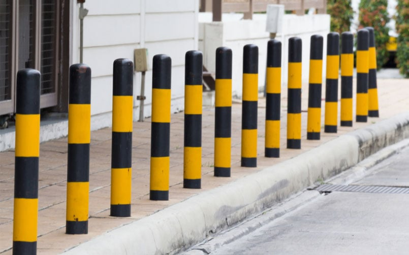

# Security Controls 

- [Security Control](#security-control)
- [System-specific, Common, and Hybrid Controls](#system-specific-common-and-hybrid-controls)
- [Main Types of Cybersecurity Controls](#types-of-cybersecurity-controls)
    - [Physical Controls](#physical-controls)
    - [Technical Controls](#technical-controls)
    - [Administrative Controls](#administrative-controls)
- [Other Types](#security-controls)
    - [Preventative Controls](#preventative-controls)
    - [Detective Controls](#detective-controls)
    - [Deterrent Controls](#deterrent-controls)
    - [Compensating Controls](#compensating-controls)
    - [Corrective Security Controls](#corrective-security-controls)
- [Administrative versus Technical](#administrative-versus-technical)

## Security Control 

Controls ensure the confidentiality, integrity, and availability of an organization's information and technology assets, focusing on people, technology, processes, and strategy.

- Upholding confidentiality, integrity, and availability.
- Controls center around people, technology, processes, and strategy.
- Cyber security controls prevent, detect, and reduce cyber-attacks and threats.
- Crucial for managing an organization's security program.

## System-specific, Common, and Hybrid Controls 

- **System-specific controls** are security controls that provide security capability for only one specific information system. 

- **Common controls** are security controls that provide security capability for multiple information systems. 

- **Hybrid controls** have characteristics of both system-specific and common controls.

## Types of Cybersecurity Controls 

### Physical Controls

Physical controls addresses security needs with hardware like badge readers and architectural features.

- **Scope**
  - Control movement in specific locations (e.g., office, factory).
  - Cover entry points and surrounding areas.

- **Integration with Technical Controls**
  - Supported by technical controls for an overall security system.

- **Examples**
  - Visitors use designated entrance, undergo identification.
  - Employees use badges or tokens for identity verification.
  - Technical controls integrate hardware for a seamless security setup:
    - readers
    - door release mechanisms
    - access control systems 

#### Bollards 

A bollard is a short post embedded into a street or sidewalk. These posts are common in city and building designs, acting as boundary markings or protective barriers.

#### Mantrap 

A Mantrap is a small room with an entry door on one wall and an exit door on the opposite wall. One door of a mantrap cannot be unlocked and opened until the opposite door has been closed and locked. Mantraps are often used in physical security to separate non-secure areas from secure areas and prevent unauthorized access.

### Technical Controls

Also termed "logical controls", Technical controls are implemented directly by computer systems and networks.

- **Functions**
  - Automated protection against unauthorized access.
  - Facilitate detection of security violations.
  - Support security requirements for applications and data.

- **Implementation**
  - Configuration settings, parameters, or hardware settings.
  - Managed through software GUI or hardware.

- **Considerations**
  - Requires significant operational considerations.
  - Must align with organizational security management.

- **Examples**
  - Access Control List

### Administrative Controls

Also known as **managerial controls**, administrative controls refers to directives, guidelines, or advisories for organization members.

- **Purpose**
  - Establish frameworks, constraints, and standards for human behavior.
  - Encompass all organizational activities and interactions.

- **Importance**
  - Powerful tools for achieving information security.
  - Even simple awareness policies can be effective controls.

- **Integration Strategies**
  - Improve overall security by integrating controls into daily task-level activities.
  - Offer in-context references, advisory resources, or link directly into training.

- **Operational Impact**
  - Shifts from executive decision-making to daily use.
  - Enhances immediacy, usefulness, and operational relevance.

- **Examples**
  - Acceptable Use Policy 
  - Emergency Operations Procedures 
  - Employee Awareness Training

Types of Administrative Controls: 

- **Procedural Controls**
Controls that are initiated by the organization.

- **Legal or Regulatory Controls**
Controls mandated by the law.

### Preventative Controls

Preventative controls aim to avoid loss or errors and include measures such as hardening, security awareness training, change management, and account disable policies.

- Hardening
- Security awareness training
- Change management
- Account disable policy.

### Detective Controls

Detective controls use internal controls to identify errors through methods like:

- Log monitoring
- SIEM
- Trend analysis
- Security audits
- Video surveillance
- Motion detection

### Deterrent Controls

Deterrent controls, often tangible objects or persons, reduce deliberate attacks through measures like:

- Cable locks
- Hardware locks
- Video surveillance
- Guards

### Compensating Controls

Compensating controls offer alternative methods to meet security requirements when standard measures are impractical or financially challenging.

- "Second-pick", if designed control is too expensive or will take long to implement.
- Time-based OTP (One-time password)
- Network isolation for IoT devices

### Corrective Security Controls 

Corrective security controls are measures used to address security vulnerabilities or weaknesses already identified. Backups, patches, and Disaster Recovery Plans are all corrective security controls (see ISC2 Study Guide, chapter 3, module 2). 

- Backups can help ensure that important information is not lost in the event of an incident. 

- Patches can help fix vulnerabilities and improve security. 
- Disaster Recovery Plans are administrative security controls that establish the corrective measures to be implemented in case of a disaster. 

Bollards are not typically considered a corrective security control.

## Administrative versus Technical 

Administrative controls are implemented through policies, procedures, and training, while technical controls use technology and hardware solutions to protect systems and data.

----------------------------------------------

[Back to main page](../../README.md#security)    